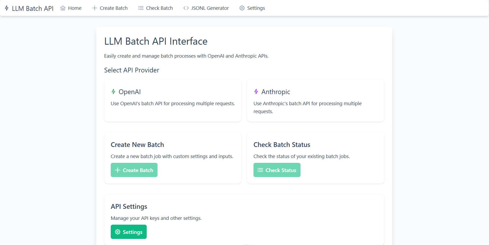

# LLM Batch API UI

A Vue.js application for easily creating and managing batch processing jobs with OpenAI and Anthropic APIs.

## Features

- **Multi-Provider Support**: Seamlessly switch between OpenAI and Anthropic batch APIs
- **Batch Job Creation**: Create batch jobs with custom settings and inputs
- **JSONL Generator**: Built-in tool to create properly formatted JSONL requests
- **Status Tracking**: Monitor the progress of your batch jobs
- **Results Viewer**: View and copy batch job results directly in the application
- **Secure API Key Management**: API keys are stored securely in your browser's local storage

## Screenshots



## Project Setup

```sh
# Install dependencies
npm install

# Compile and Hot-Reload for Development
npm run dev

# Compile and Minify for Production
npm run build
```

## Technology Stack

- [Vue 3](https://vuejs.org/) - Frontend framework
- [Vite](https://vitejs.dev/) - Build tool
- [PrimeVue](https://primevue.org/) - UI Component library
- [Tailwind CSS](https://tailwindcss.com/) - Utility-first CSS framework
- [Vue Router](https://router.vuejs.org/) - Routing

## Usage Guide

### Getting Started

1. Visit the home page and select your preferred API provider (OpenAI or Anthropic)
2. Navigate to the Settings page to configure your API keys
3. Create a new batch job or check the status of existing jobs

### Creating a Batch Job

1. Navigate to the "Create Batch" page
2. Enter your API key or verify your stored API key
3. Configure your batch job settings and input data in JSONL format
4. Review your configuration and submit the batch job

### Using the JSONL Generator

1. Navigate to the "JSONL Generator" page
2. Add requests by clicking "Add New Request"
3. Configure each request with the appropriate model, messages, and parameters
4. Copy the generated JSONL for use in batch jobs

### Checking Batch Status

1. Navigate to the "Check Batch" page
2. Enter a batch ID or select a previously created batch
3. View batch details, status, and results when available
4. Download or view results directly in the application

## Environment Setup

The application requires proxy settings for API requests to avoid CORS issues. This is configured in the `vite.config.js` file.

## Security Considerations

- API keys are stored in the browser's local storage
- Direct API requests to Anthropic use the `anthropic-dangerous-direct-browser-access` header for development purposes
- In production, it's recommended to use a backend service to handle API calls

## License

[MIT License](./LICENSE)

## Contributing

Contributions are welcome! Please feel free to submit a Pull Request.

## Acknowledgements

- OpenAI and Anthropic for providing the APIs
- The Vue.js community for the excellent documentation and resources